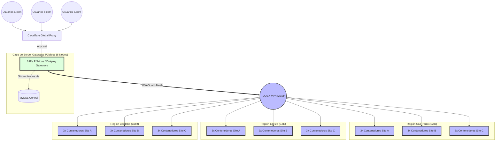

# 🧠 Tudex Networks: Global Mesh Gateway (Headscale + HAProxy + MySQL)

| Especificación | Detalle |
| :--- | :--- |
| **Rol del Sistema** | Controlador VPN Mesh Centralizado & Balanceador de Carga Global |
| **Repositorio** | `vpn.tudexnetworks.com` |
| **Orquestación** | Dokploy / Docker Compose |
| **Componentes** | Headscale (Mesh), HAProxy (Gateway), MySQL (Estado/Cluster) |
| **Filosofía** | **Soberanía de Datos** — Red 100% privada, descentralizada y segura |

---

## 📖 1. Visión General de la Arquitectura

Este repositorio define la infraestructura subyacente que conecta de manera segura todos los servidores físicos y virtuales de **Tudex Networks** a nivel global.

No es solo una VPN. Es un **Gateway Inteligente de Alta Disponibilidad** que encapsula tres funciones críticas en un solo sistema auto-sincronizado:

1. **Control Plane VPN (Headscale):** El cerebro central. Autentica nodos, negocia las claves criptográficas (WireGuard) y mantiene el mapa de la red privada (`100.64.0.0/10`).
2. **Balanceador de Tráfico Borde (HAProxy):** Actúa como puerta de entrada pública. Recibe peticiones de internet (ej. `a.com`) y las enruta automáticamente al nodo correcto dentro de la VPN usando MagicDNS.
3. **Clustering Automático (MySQL):** Permite replicar este "Cerebro/Gateway" en múltiples países simultáneamente compartiendo las mismas claves de identidad de red, logrando Alta Disponibilidad (HA) real.

### Principios Fundamentales
* **Zero Exposición:** Los nodos de aplicación (Ej: Backend en Ezeiza) **no tienen puertos abiertos a Internet**. Todo su tráfico entrante se origina en esta red Mesh.
* **Zero-Configuración:** Los nuevos nodos se registran solos usando una Auth Key, obteniendo una IP fija y un nombre DNS persistente.
* **Inmutabilidad:** Todo el sistema se despliega directamente desde el código. Si un nodo público se destruye, se levanta otro en segundos y la red se reconstruye sola.

---

## 🗺️ 2. Topología de Red y Flujo de Tráfico

El diseño del sistema se basa en una topología "Hub & Spoke / Mesh", donde los nodos públicos (Gateways) son la cara visible de Internet, y los nodos de procesamiento (Backends) residen en la sombra.

### Diagrama de Flujo (Borde a Nodo)



### Explicación del Enrutamiento Dinámico (Auto-Mapeo)
Cualquier petición que llega a HAProxy se procesa de la siguiente manera:
1. HAProxy lee la cabecera HTTP `Host` (Ej: `app1.tudex.com`).
2. Extrae el subdominio principal (`app1`).
3. Busca resolver ese subdominio dentro de la red privada a través del MagicDNS nativo proporcionado por Headscale (`app1.vpn.internal`).
4. Si el nodo `app1` está online en la VPN, HAProxy reenvía la carga útil HTTP directamente a través del túnel WireGuard cifrado a su IP `100.64.x.x` en el puerto 80.

---

## ⚙️ 3. Sistema de Auto-Clustering (MySQL Sync)

Para evitar que el nodo Gateway sea un único punto de fallo (SPOF), la infraestructura soporta el despliegue de **múltiples instancias públicas** (Gateways) en paralelo. 

Para que múltiples servidores Headscale operen la misma red, deben compartir una identidad criptográfica común (Private Key y Noise Key). Aquí entra el **Script de Auto-Sincronización** (`entrypoint.sh`):

1. **Al iniciar el contenedor:** Se conecta a la base de datos MySQL externa compartida.
2. **Si la DB no tiene claves:** Asume que es el "nodo master fundador". Genera las claves criptográficas base usando el binario de Headscale y las inyecta en la tabla `headscale_secrets` de MySQL.
3. **Si la DB ya tiene claves:** Descarga las claves existentes y las inscribe localmente.
4. **Resultado:** 10 servidores Gateway pueden levantarse independientemente en 10 partes del mundo, y todos reclamarán la propiedad de la misma red (`100.64.x.x`), permitiendo a los nodos privados conectarse a cualquiera de ellos indistintamente.

---

## 🚀 4. Guía de Despliegue en Dokploy

### 4.1. Requisitos Previos
* Una base de datos MySQL/MariaDB accesible por las instancias.
* Servidores(VPS/Baremetal) con Dokploy instalado y expuestos a Internet.

### 4.2. Configuración del Entorno (.env)
En tu proyecto de Dokploy (`tudex-vpn-gateway`), añade las siguientes variables de entorno:

```env
# Configuración del Cluster (Base de Datos Centralizada)
DB_TYPE=postgres            # No modificar. Nuestro driver MySQL procesa bajo esta var en este contexto
DB_HOST=mysql.tudex.internal # IP o Endpoint de tu MySQL
DB_PORT=3306                # Puerto MySQL
DB_NAME=headscale_db        # Nombre de la DB
DB_USER=headscale_user      # Usuario MySQL
DB_PASS=SecretoSuperSeguro  # Contraseña MySQL
```

### 4.3. Despliegue
Crea el proyecto usando Compose (o vinculando a este repositorio Git). Dokploy construirá la imagen (`Dockerfile`) integrando Alpine, HAProxy, MariaDB Client y Headscale.

### 4.4. Exposición (Red Externa)
En Dokploy, ve a **Dominios** y enruta tu dominio principal (Ej: `vpn.tudexnetworks.com`) hacia el puerto interno **8080** del contenedor (este es el plano de control de Headscale donde se conectan los clientes Tailscale).

El tráfico web entrante que deseas balancear (ej. `*.tudex.com`) debe apuntar al puerto **80** del contenedor (HAProxy).

---

## 🔐 5. Despliegue de Nodos Privados (Zero-Config)

Una vez que el Gateway (o el cluster de Gateways) está online, necesitas registrar tus nodos de infraestructura (los "Spokes"). 

### Paso 1: Generar un AuthKey (Se ejecuta solo una vez en cualquier Gateway)
Entra a la terminal del contenedor del Gateway y crea el namespace base y una clave de autenticación persistente:

```bash
# Crear el tenant lógico
headscale users create tudex

# Crear una auth key vitalicia (1 año) y reutilizable
headscale preauthkeys create -u tudex -e 365d --reusable
```

El sistema devolverá algo como `hskey-auth-XYZ...`. Esa es tu **Clave Maestra de Infraestructura**.

### Paso 2: Unir nodos desde cualquier parte del mundo
En el `.env` del nodo privado que vayas a levantar (por ejemplo, en el docker-compose del servidor de Ezeiza), inserta lo siguiente:

```env
TS_AUTHKEY=hskey-auth-XYZ...
TS_LOGIN_SERVER=https://vpn.tudexnetworks.com
```

Al iniciar el sidecar de Tailscale en ese nodo, suceden tres cosas automáticas:
1. Se autentica contra el cluster `vpn.tudexnetworks.com`.
2. Headscale le asigna una IP privada cifrada (Ej: `100.64.0.10`).
3. El MagicDNS registra el hostname de esa máquina (Ej: si la máquina se llama `core-api`, automáticamente se registra `core-api.vpn.internal`).

¡Listo! `core-api` ahora es accesible estáticamente por HAProxy, sin que sus puertos estén abiertos al Internet público.

---

## 🛠️ 6. Referencia de Comandos CLI y Mantenimiento

Administración directa operando desde la consola del Gateway:

**Gestión de Nodos**
* `headscale nodes list`: Lista todos los servidores unidos a la VPN Mesh y sus IPs asignadas.
* `headscale nodes delete --identifier <ID>`: Desconecta permanentemente y expulsa un nodo vulnerado.
* `headscale --user tudex nodes rename <ID> <nuevonombre>`: Fuerza un renombramiento (afecta al MagicDNS).

**Gestión de Rutas y Relays (DERP)**
* `headscale routes list`: Verifica las subredes anunciadas.
* `headscale derp list`: Comprueba la conexión a los relays de Tailscale (usados si falla el P2P directo por firewalls estrictos).

---

## 📊 7. Observabilidad y Monitoreo

* **Métricas Headscale (Prometheus):** Expuestas internamente en el puerto `9090` del contenedor.
* **Panel de HAProxy:** HAProxy ofrece un dashboard gráfico de salud de toda tu red interna. Accesible (si se enruta en Dokploy) exponiendo el puerto `8404` del contenedor. Ruta por defecto: `http://[IP_PUBLICA]:8404/stats`. 
  * *Muestra caídas de nodos en tiempo real y estadísticas de latencia y volumen de tráfico a través de la Mesh.*

---
*Tudex Networks Infrastructure Team.*
